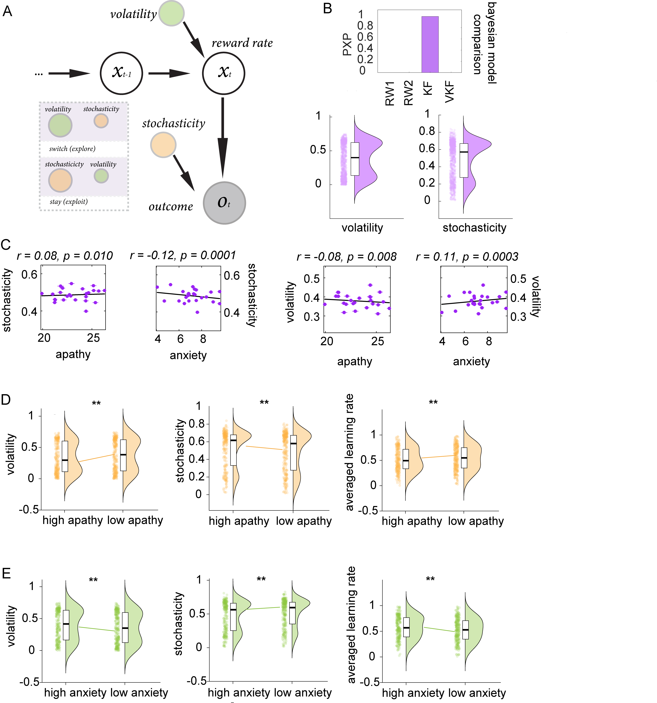
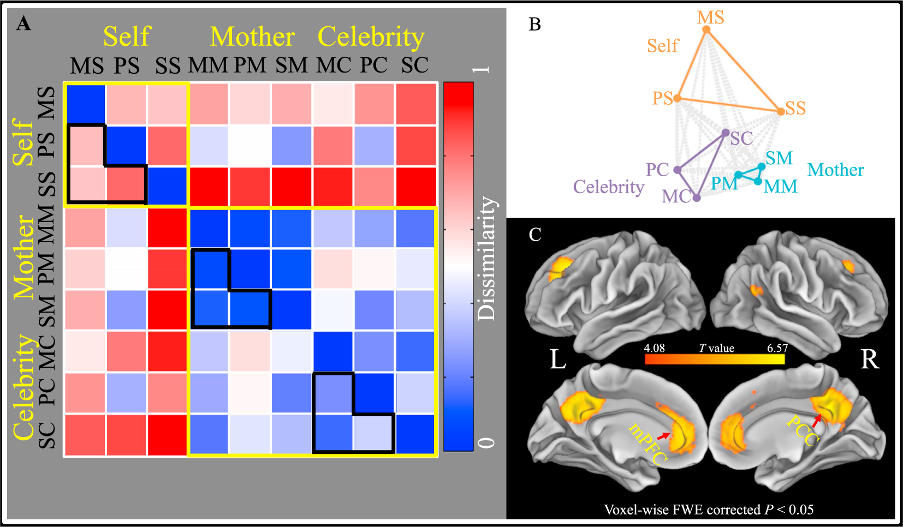
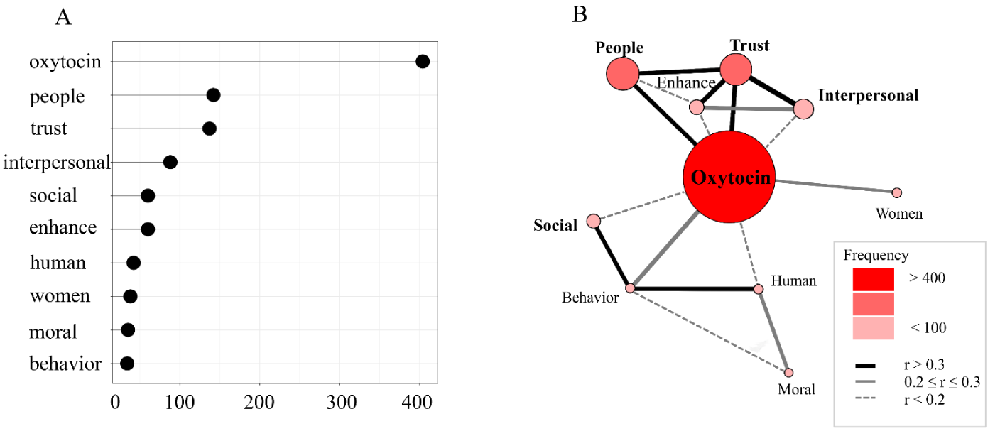

::: {.hero}

::: {}
# Xinyuan Yan
::: {.role}
PhD · Postdoctoral Researcher, Baylor College of Medicine
:::

::: {.links}
[CV](CV_YanX.pdf){target="_blank"}
[Google Scholar](https://scholar.google.com/citations?user=rdGDTMsAAAAJ){target="_blank"}
[GitHub](https://github.com/psywalkeryanxy){target="_blank"}
[Email](mailto:your-email@bcm.edu)
:::
:::
:::

::: {.section-label}
About
:::

A normal person. Find science fascinating. A passerby on Earth.

For the past decade I have been learning how to do science — first through fMRI and behavioral modeling of social value learning and decision-making, more recently through intracranial recordings of human uncertainty, value, and concept representations in collaboration with [Dr. Sameer Sheth](https://www.bcm.edu/people-search/sameer-sheth-32130) and [Dr. Ben Hayden](https://www.bcm.edu/people-search/benjamin-hayden-37790) at Baylor College of Medicine.

What I hope to spend the rest of my life thinking about: how the brain represents multimodal concepts; why and how different languages — spoken and signed — converge on the same conceptual space; how new concepts are learned and stably maintained; and how concepts link to affect.

::: {.section-label}
My Light
:::

> But the fruit of the Spirit is love, joy, peace, patience, kindness, goodness, faithfulness, gentleness, self-control; against such things there is no law.
>
> — Galatians 5:22–23 (ESV)

---

## Featured Publications

::: {.featured-pub}

::: {}
::: {.pub-title}
Distinct computational mechanisms of uncertainty processing explain opposing exploratory behaviors in anxiety and apathy
:::
::: {.pub-authors}
**Yan, X.**, Ebitz, R. B., Grissom, N., Darrow, D. P., & Herman, A. B.
:::
::: {.pub-venue}
Biological Psychiatry: Cognitive Neuroscience and Neuroimaging · 2025
:::
::: {.pub-summary}
Distinct computational mechanisms underlie exploration deficits in anxiety vs. apathy. Anxiety increases sensitivity to environmental uncertainty, driving excessive exploration; apathy reduces sensitivity to reward information, causing exploitation of known options.
:::
::: {.pub-links}
[Paper](published_papers/2025_BPCNNI.pdf){target="_blank"} · [Supplementary](published_papers/2025_SI_BPCNNI.pdf){target="_blank"} · [Reviewer responses](published_papers/2025_RR_BPCNNI.pdf){target="_blank"}
:::
:::
:::

::: {.featured-pub}

::: {}
::: {.pub-title}
Neural representations of the multidimensional self in the cortical midline structures
:::
::: {.pub-authors}
Feng, C.†, **Yan, X.**†, Huang, W., & Ma, Y. (†equal contribution)
:::
::: {.pub-venue}
NeuroImage · 2018, 183: 291–299
:::
::: {.pub-summary}
Representational similarity analysis of fMRI data showed that mPFC and PCC patterns distinguish self from others *and* discriminate dimensions (traits, physical attributes, social roles) of self-knowledge — suggesting distinct codes for identity-sensitive vs. dimension-sensitive self-representations.
:::
::: {.pub-links}
[Paper](published_papers/2018_NI.pdf){target="_blank"} · [Supplementary](published_papers/2018_SI_NI.pdf){target="_blank"}
:::
:::
:::

::: {.featured-pub}

::: {}
::: {.pub-title}
Placebo treatment facilitates social trust and approach behavior
:::
::: {.pub-authors}
**Yan, X.**, Yong, X., Huang, W., & Ma, Y.
:::
::: {.pub-venue}
PNAS · 2018, 115(22): 5732–5737
:::
::: {.pub-summary}
The mere belief in receiving a pro-social drug increases social trust and approach behavior toward strangers — revealing how expectation shapes interpersonal behavior independent of pharmacological action.
:::
::: {.pub-links}
[Paper](published_papers/2018_PNAS.pdf){target="_blank"} · [Supplementary](published_papers/2018_SI_PNAS.pdf){target="_blank"}
:::
:::
:::

[All publications on Google Scholar →](https://scholar.google.com/citations?user=rdGDTMsAAAAJ){target="_blank"}
