::: {.photo-grid}

<a href="img/01.jpg" data-caption="Chengdu, Cat, and Yiping">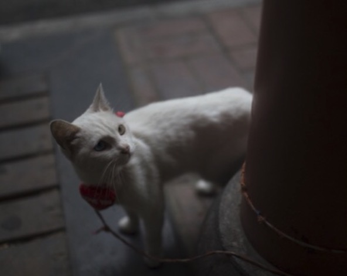</a>

<a href="img/02.jpg" data-caption="Sichuan, horse, and Xiangwei">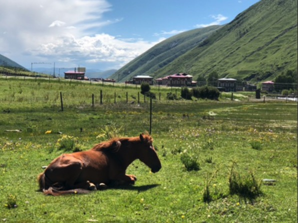</a>

<a href="img/03.jpg" data-caption="Lavender">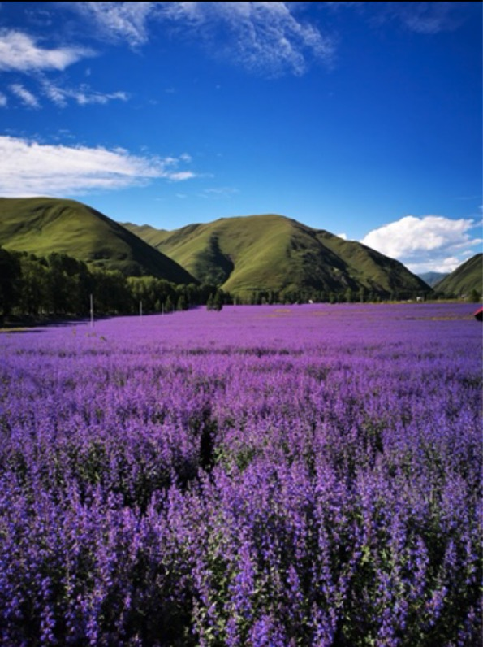</a>

<a href="img/04.jpg" data-caption="གསེར་རྟ་">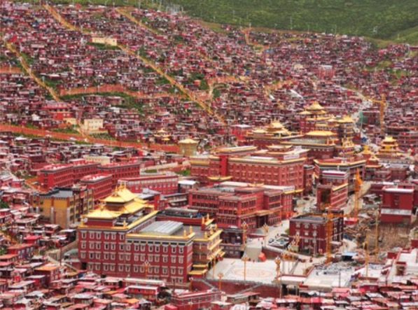</a>

<a href="img/05.jpg" data-caption="NENU">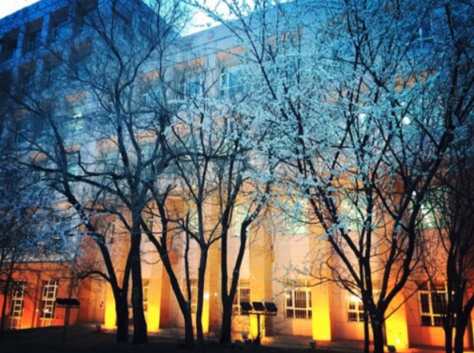</a>

<a href="img/06.jpg" data-caption="Yading Nature Reserve">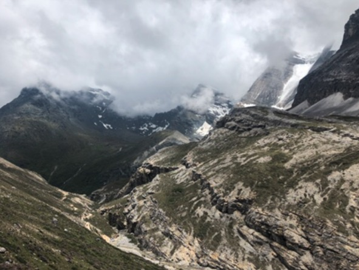</a>

<a href="img/07.jpg" data-caption="Aurora, MN — Hong, Yu, Mohan, Jess">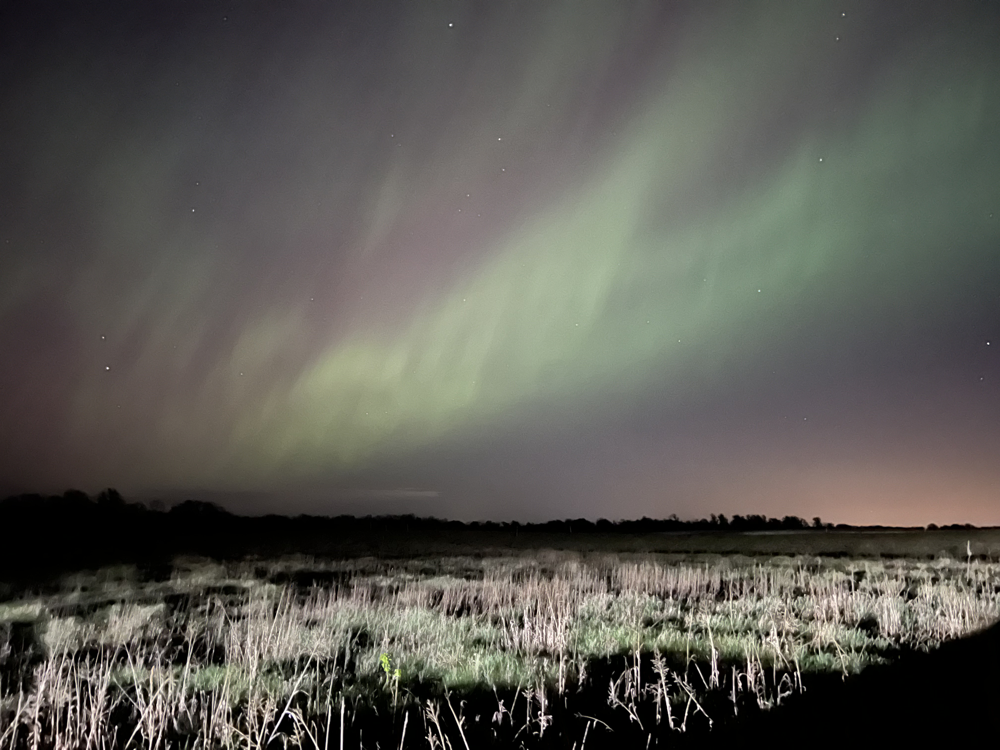</a>

<a href="img/08.jpg" data-caption="Joshua Tree National Park — Ji-An, Mengping">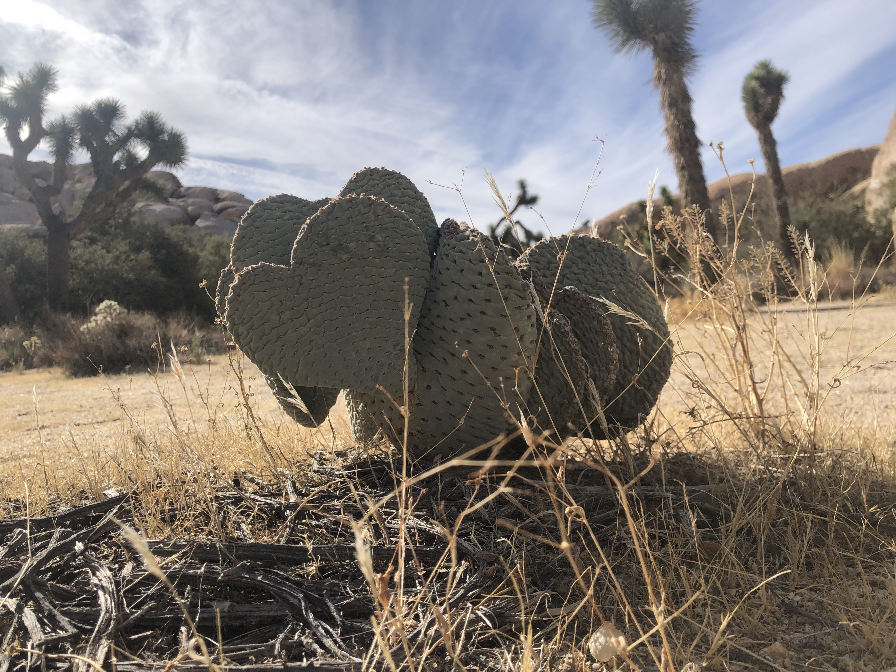</a>

<a href="img/09.jpg" data-caption="Yosemite National Park — Shaonan, Mengping">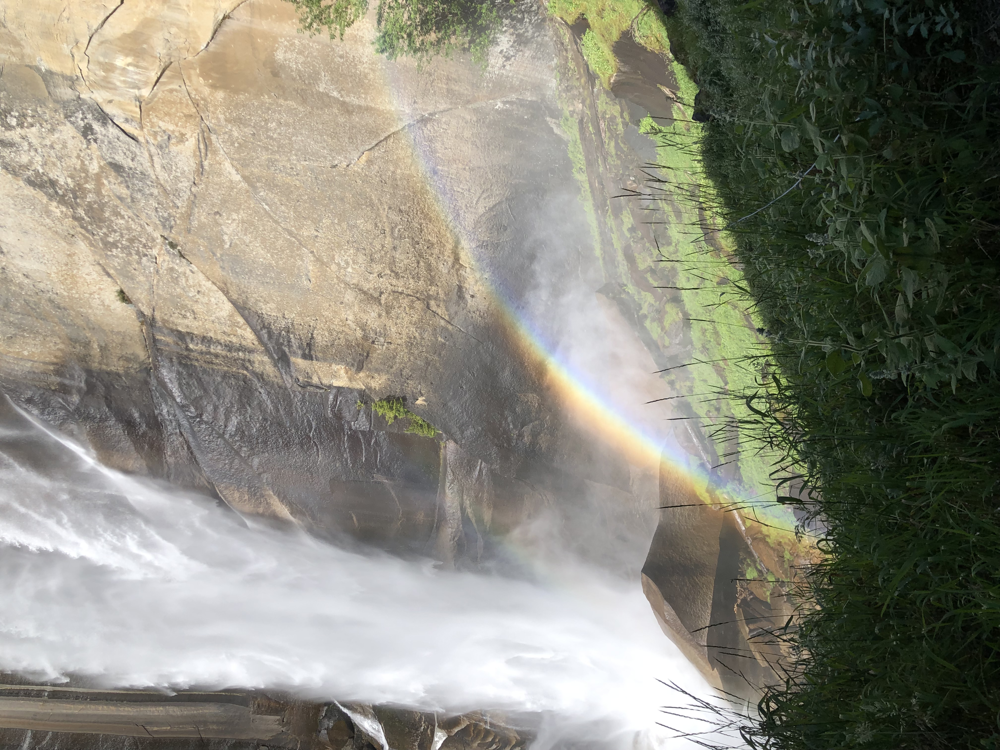</a>

<a href="img/10.jpg" data-caption="UMN running club">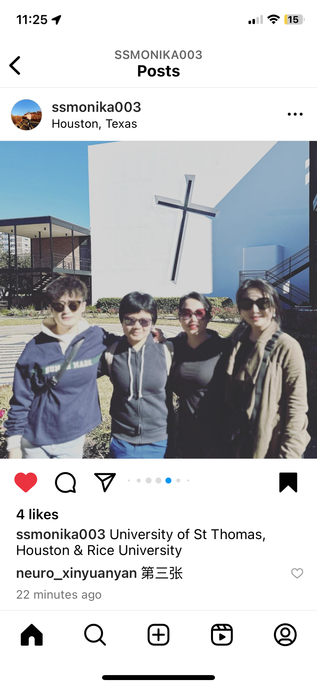</a>

<a href="img/12.jpg" data-caption="Birthday cake — Mohan">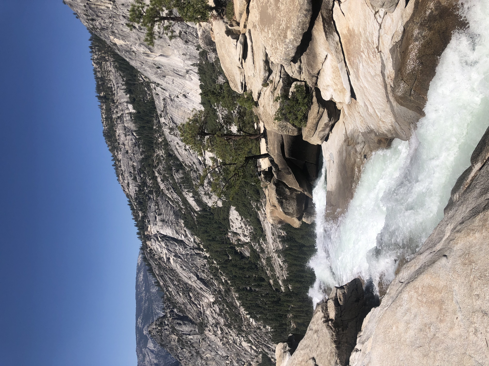</a>

:::

  
  

