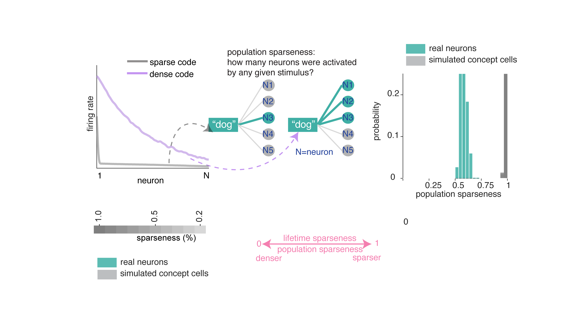
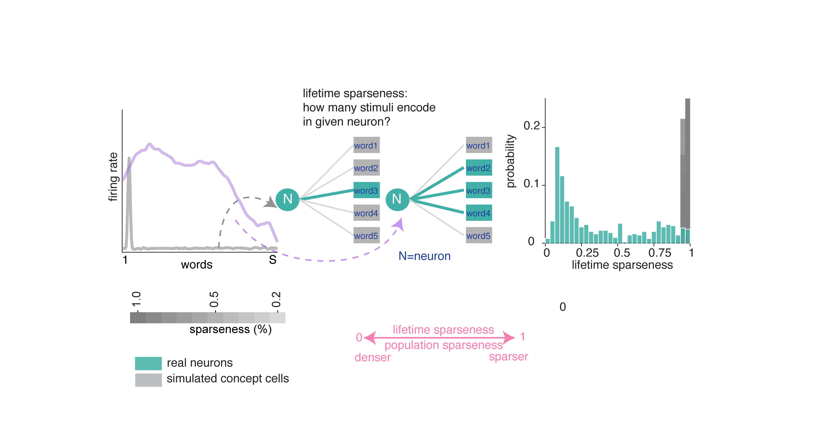
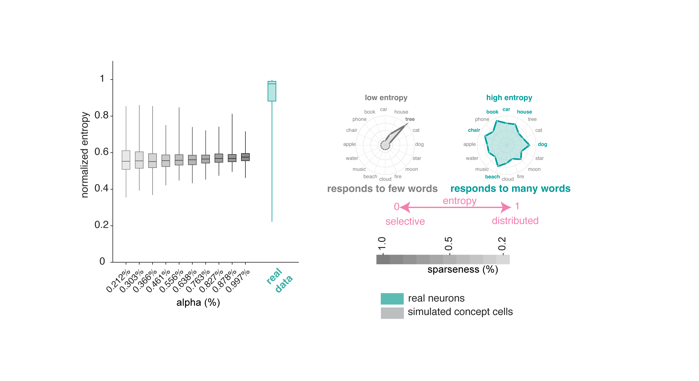
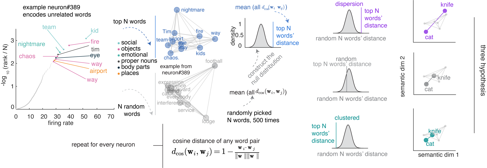
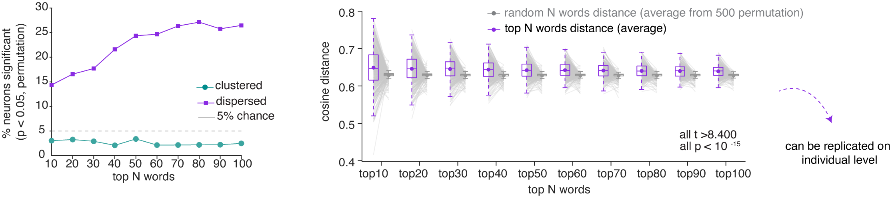
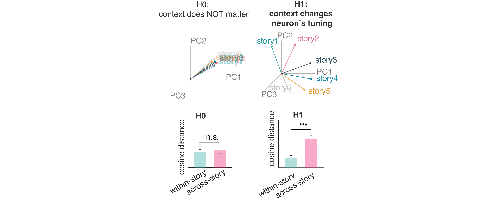

::: {.author-list}
Xinyuan Yan^1^, Ji-An Li^2^, Melissa Franch^1^, Hanlin Zhu^1^, Rhiannon Cowan^3^, James Belanger^1^, Ana G. Chavez^1^, Assia Chericoni^1^, Taha Ismail^1^, Kalman A. Katlowitz^1^, Luca D. Kolibius^4^, Elizabeth A. Mickiewicz^1^, Danika Paulo^1^, Eleonora Bartoli^1^, Jay A. Hennig^1,5,6,7^, Tomasz M. Frączek^1^, Nicole R. Provenza^1,5,6,7^, Shervin Rahimpour^3^, Ben Shofty^3^, Elliot Smith^3^, Joshua Jacobs^4^, Benjamin Y. Hayden^\*†1,5,6,7^, and Sameer A. Sheth^\*1,5,6,7^
:::

::: {.affiliations}
1. Department of Neurosurgery, Baylor College of Medicine
2. Department of Psychology, New York University
3. Department of Neurosurgery, University of Utah
4. Department of Neurology, University of Chicago
5. Department of Electrical and Computer Engineering, Rice University
6. Department of Bioengineering, Rice University
7. Neuroengineering Initiative, Rice University

::: {.footnote-symbols}
\* These authors contributed equally

† Correspondence: [Benjamin.Hayden@bcm.edu](mailto:Benjamin.Hayden@bcm.edu)
:::
:::

::: {.blog-authors}
**Blog post written by:** [Xinyuan Yan](https://scholar.google.com/citations?user=rdGDTMsAAAAJ) and [Benjamin Hayden](https://scholar.google.com/citations?user=MN2ueWEAAAAJ)
:::

*For more details, see the [preprint](https://www.biorxiv.org/content/10.64898/2026.05.02.722435v1).*

When we hear speech, neurons in our brains represent the words' meanings (Franch et al., 2026). But there is no simple one-to-one relationship between neurons and words. Instead, each word is associated with a distinct pattern of neural activity, and the particular pattern depends on the context. Here, we studied the principles that determine those patterns. We found that each neuron responds to multiple unrelated words, and the set of words that drive the neuron are more distinct than expected by chance. These results indicate that neurons have the principle of **polysemanticity**, meaning each neuron responds to multiple unrelated stimuli (Olah, 2017; Olah, 2020). That in turn supports the idea that the brain utilizes the principle of **superposition**, which allows it to flexibly represent more stimuli than it has coding dimensions (Elhage et al., 2022).

We studied neurons from the brains of 15 humans with electrodes implanted in the hippocampus for detection of seizure onset zone in intractable epilepsy. Participants listened to six podcasts from *The Moth Radio Hour*, consisting of 7,346 words over 47 minutes.

For example:

<iframe width="560" height="315" src="https://www.youtube.com/embed/9sGmJMgGDU8" title="The Moth Radio Hour" frameborder="0" allow="accelerometer; autoplay; clipboard-write; encrypted-media; gyroscope; picture-in-picture; web-share" allowfullscreen></iframe>

We recorded a total of 498 neurons, and sampled broadly within the hippocampus.

Neurons were well isolated.^[All spike sorting procedures were done by hand and checked by at least one other lab member.]

## Hippocampal neurons encode semantics

Before we look at which of several possible ways neurons might encode semantics, we need to convince ourselves that they do indeed encode semantics at all. We used a now-standard encoding model approach to quantify semantic tuning.^[We used ridge regression (Zada et al. 2025; Caucheteux and King 2022; Jamali et al. 2024; Franch et al., 2026; Yan et al., 2026). We defined performance as the cross-validated log-likelihood improvement over an intercept-only baseline. As predictors, we used the first 100 principal components of GPT-2 embeddings (Layer 36, Radford et al., 2019). Because of our interest in how word concepts are encoded, we analyzed only nouns.] We were able to decode single words from the responses of population neurons. Many words were reconstructed perfectly; nearly all others were close.

## Neuronal responses recapitulate the structure of the semantic embedding space

Distances between neural patterns evoked by specific words are correlated with distances between their semantic embeddings.^[Using representational similarity analysis, RSA; Kriegeskorte et al. 2008; Nili et al. 2014.] This finding confirms our previously published results using a new method (Franch et al., 2026), and extends those results by showing that the degree of correspondence increases with population size. This scaling behavior suggests the semantic encoding is distributed because it implies that individual neurons carry partial, overlapping information about many words that accumulate across the population (cf. Kafashan et al. 2021).

Overall, our data support the idea that neurons represent word meanings through patterns of activation, rather than through specialized "monosemantic" neurons that respond to each concept with something like a one-hot code (such as concept cells, Quiroga, 2012). To see what kinds of results these analyses would produce with concept cells, we repeated the above analyses on simulated concept cell populations. Unlike real neurons, simulated concept cells showed no monotonically increasing RSA with population size and produced near-zero correlations with GPT-2 semantic geometry at all sparseness levels.

## Neurons with similar tuning do not form natural functional clusters

A monosemantic neuron (a neuron that responds to a single concept) will only respond to words that are semantically adjacent (such as "dog" and "canine"). Here semantic adjacency can be high dimensional, so it would include, for example, abstract relationships that cross basic person/animal/place/thing category lines, such as Christmastime (which would include "Santa claus", "reindeer", "North Pole", and "candy cane"). A polysemantic code, by contrast, predicts no such categorical grouping in the set of driving stimuli for a neuron. Indeed, grouping may even be overdispersed.

To quantify the internal coding structure within the population, we used a technique called symmetric non-negative matrix factorization (NMF; Lee and Seung 1999).^[NMF decomposes the similarity matrix into discrete components, each reflecting a distinct linear reweighting of the entire neural population. It produces neuronal "modules," each representing a functionally coherent structure within the space of possible population tuning functions.] We then ask whether these neurally-derived modules align with the structure of semantic space as determined by word models.^[We used fastText because we are interested in context-free embeddings.] This analysis revealed thirteen modules.^[This number was selected by computing reconstruction error and identifying the point of greatest curvature change in the error curve. We confirmed module validity by comparing its reconstruction error against a null distribution.] We defined semantic categories by performing k-means clustering on the fastText word embeddings to define discrete semantic categories. This method will find any categories that are latent in the training corpus, including both natural categories (e.g., animals) or abstract ones (e.g., "things related to Christmas" or "things you might encounter at the beach"). We found that NMF-driven modules do not map onto single fastText-derived semantic categories. Instead, each module recruits words from multiple semantic categories (e.g., Modules 7 and 11 each span six different semantic categories).

To quantify this observation, we compared the mean pairwise semantic distance among each module's top-scoring words against a null distribution constructed by randomly sampling the same number of words. Only one of thirteen modules showed significantly clustered semantics; eight modules were indistinguishable from chance, and four were significantly more dispersed than chance, meaning their top words were drawn from more distant regions of semantic space than expected by chance. In other words, a given neuron's semantic repertoire is biased towards overdispersion.^[This pattern is replicated at the individual patient level.]

## Semantic coding is dense

We next formally quantified the degree of coding density in our neurons. Coding density, in general, measures how much of the possible coding space any given word occupies.

**Population sparseness** quantifies how selectively a given word activates the neural population (Figure 2A; Rolls and Treves 1997). We find population sparseness is moderate. We compared this result to data generated from simulated concept cells.^[Method follows Waydo et al. 2006. Because Waydo et al. argue for a range of plausible sparseness parameters (0.20% to 1.0%), we confirmed this result using ten sparseness levels in this range.] In short, neurons in our dataset use a much denser code than the simulated concept cells.

**Lifetime sparseness** quantifies how selectively a given neuron responds across words: values near 1 indicate firing to a single word, while values near 0 indicate uniform responding (Rolls and Treves 1997). Lifetime sparseness of neurons in the hippocampus (mean ± std = 0.369 ± 0.305) is considerably denser than the simulated concept cells.

**Normalized Shannon entropy** measures how uniformly a neuron distributes its firing across words.^[0 = maximally sparse, responding to a single word; 1 = maximally dense, responding uniformly to all words. See Methods; Lehky et al. 2005.] Neurons in our sample show relatively high entropy, that is, closer to responding to all words uniformly (mean ± std = 0.910 ± 0.130). Simulated concept cells produced much lower entropy values.

A neuron could have high entropy (responds to many words) but carry very little information if its rate variations don't reliably distinguish between words. In other words, apparent density could be a by-product of high noise or variability. To test for this possibility, we computed the information per word.^[Skaggs, McNaughton, et al. 1992. See Methods. Wilcoxon rank-sum test, all p < 0.001.] Neurons in our dataset convey substantially more information per word than simulated concept cells. This result confirms that the broad tuning (high entropy) we observe is functionally meaningful and supports fine-grained discrimination among words.

## Hippocampal neurons are polysemantic

One way to visualize a neuron's tuning function is to look at its predicted responses to a large corpus. Here we used a standard 50,000 noun corpus (Joulin et al., 2016) and we show the predicted response of three example neurons to this corpus. These show complex patterns of activation, with responding to a wide range of stimuli along with local clusters of particularly strong activation (which we call "modes").

For comparison, we calculated estimated responses of simulated concept cells, which have the expected narrow peaks corresponding to their preferred concepts.

We identified individual modes using DBSCAN clustering of high-firing words in t-SNE 2D semantic plane.^[Density-based clustering is more effective than in high-dimensional spaces due to distance concentration (Aggarwal et al. 2001). For each mode, we then computed its centroid as the firing-rate-weighted mean of all the words within that mode in the original high-dimensional space. Note that all subsequent geometric analyses are based on the mode centroids in the original embedding space, rather than the reduced t-SNE space.] We then asked four geometric questions about how these modes are arranged:

We assessed the **regularity of inter-mode spacing** by computing the coefficient of variation (CV) of all pairwise distances between mode centroids. The population showed significantly more regular spacing than chance.

We assessed the **uniformity of nearest-neighbor distances** between modes. The population showed significantly more equidistant nearest neighbor spacing than chance.

We assessed the **directional arrangement** of modes by computing the CV of pairwise cosine similarities among direction vectors from the grand centroid to each mode centroid in the high-dimensional embedding space. The population was significantly more isotropic than chance, indicating that modes were more likely distributed uniformly across all directions in semantic space rather than concentrated along a few preferred directions, as grid cells would.

We then assessed **hexagonality / gridness** of mode location.^[Gridness scores follow Hafting et al. 2005; Langston et al. 2010.] We found no evidence of hexagonal symmetry in the hippocampal population's semantic tuning maps. Specifically, gridness scores were negative.

In summary, hippocampal semantic representations are organized into regularly spaced, approximately equidistant, and isotropically distributed modes, without the periodic hexagonal symmetry characteristic of grid cells in two dimensions. However, this structure is reminiscent of grid cell geometry in high (specifically, three) dimensional and non-uniform environments (Ginosar et al. 2021, 2023; Krupic et al. 2015; Grieves et al. 2021).

Note that PCA produces dense components, while ridge regression penalizes large weights without eliminating them. It is possible therefore that this pipeline may artifactually favor distributed codes by construction. To test for this possibility, we conducted a control analysis using a sparse-dominated alternative.^[Non-negative matrix factorization (NMF, Lee and Seung 1999) for embedding decomposition paired with elastic net regression (L1 ratio = 0.9), which promotes sparsity by forcing the coefficients of less relevant features to exactly zero.] None of these results were affected by the choice of encoding model.

## Overdispersion of semantic modes in single hippocampal neurons

The isotropic geometric feature suggests that neuronal responses may be more semantically dispersed (overdispersion) than if their optimal driving stimuli were random. To test for overdispersion, for each neuron we identified the top N preferred nouns (by firing rate) and computed their mean pairwise cosine distance in GPT-2 embedding space, comparing this against a null distribution constructed from random nouns. 

Across the population, the proportion of neurons whose preferred nouns are significantly more dispersed than chance. This pattern is not an artifact of the N we chose, as it holds across a range of Ns.^[Specifically, all values of N from 10 to 100, Figure 3J.]

## Context reshapes single-neuron tuning while preserving population geometry

One of the biggest benefits of polysemanticity is the ability to implement contextualization without special ancillary populations or rapid tuning shifts. We next asked whether hippocampal semantic tuning functions are modulated by context.

We first evaluated each neuron's semantic tuning within versus across stories.^[For each neuron, we computed split-half tuning vectors from random halves (repeated 50 times with different random splits) of the same story and from different stories.] Across-story cosine distances were greater than within-story distances, indicating that individual neurons adopt different semantic tuning depending on story context. This cross-story change in semantic tuning was individually significant in all fifteen patients. This effect is not explainable by representational drift, as across-story tuning distance did not correlate with temporal separation between stories.

Despite these context-dependent shifts in individual neurons' tuning, the population-level geometric arrangement of word representations was preserved across narratives.^[For each pair of stories (6×5/2 = 15 pairs), we identified nouns that appeared in both stories and computed the pairwise distance (representational dissimilarity matrix, RDM) of these shared words separately within each story. The correlation between story-specific RDMs was significantly higher than null distributions constructed from mismatched random words across all 15 story pairs (observed r = 0.206 ± 0.126, null r = -0.001 ± 0.010; Wilcoxon signed-rank, p < 0.001).] In other words, sets of nouns maintain similar geometric relationships to each other regardless of their narrative context, even as neurons shift their tuning across stories.

## Context changes how neurons read meaning in a non-linear mixed selectivity way

A neuron's response to a word doesn't happen in a vacuum. The same word — *bank*, *fly*, *cell* — can mean different things depending on what came before it. We asked whether hippocampal neurons are sensitive to that.

We compared three ways a neuron might use context to shape its firing. The first ignored context entirely and predicted activity from word identity alone. The second added context as a separate ingredient — the surrounding words could push firing up or down, but they couldn't change *what the neuron cared about*. The third allowed context and word to interact, so that the surrounding words could actually reshape how the neuron responded to meaning.

The third model won, across nearly every context window we tested. Adding context as a side ingredient helped, but letting context *bend* the neuron's tuning helped more. About a quarter of all the neurons we recorded only showed up as meaningful in this third model — they looked silent under simpler analyses, but came alive once we accounted for the interaction. And the effect cut across categories: many of the neurons that seemed to be encoding pure word identity, or pure context, turned out to be doing something more interesting.

What this means is that local context doesn't just nudge a neuron's firing rate up or down. It changes the question the neuron is asking. The same neuron reads meaning differently depending on what was just said.

## Polysemantic codes enable pattern separation

Pattern separation is the process by which the hippocampus transforms overlapping inputs into distinct, non-interfering neural representations (Yassa and Stark, 2011). We next asked whether and how hippocampus maps identical lexical inputs onto distinct neural representations when they occur in different semantic contexts. Identical word inputs should evoke distinct population responses in different contexts, and that the magnitude of this shift should scale with the distance between those contexts (Ethayarajh 2019).

For each noun appearing at least five times across the podcast, we computed pairwise distances among its occurrences in lexical context space and target word space.^[Lexical context space is defined as the mean population firing rate vector across the 1–20 words immediately preceding each occurrence; target word space is the population response to the noun itself.] Across the population, observed context–repeated word geometry coupling (averaged across all repeated words with occurrence ≥ 5) significantly exceeded a random-context null baseline across all context window sizes (1 to 20 preceding words used to define the context vector). This finding goes beyond showing that context shifts responses (see above): it demonstrates that the population maps contextual dissimilarities onto representational dissimilarity in a graded manner. This graded coupling between contextual distance and representational distance shows how vectorial semantic representations can implement semantic pattern separation.

## Polysemantic codes enable pattern completion

Pattern completion is the computational process by which the hippocampus retrieves a holistic neural representation from a partial or degraded input (Rolls 2013; Yassa and Stark 2011). In language, the brain can map novel or incomplete inputs onto the appropriate semantic region defined by previously learned word relationships.

Concept cells are excellent at pattern completion: they efficiently retrieve a holistic identity from degraded sensory inputs (Quiroga et al., 2012). However, they lack the high-dimensional capacity for relational pattern completion, in which the system can utilize the high-dimensional relationships between modes to infer a specific context. On the other hand, by leveraging the superposition of unrelated features, a single polysemantic neuron can participate in multiple attractor states, allowing the broader network to complete a complex narrative by collapsing onto the correct semantic manifold as contextual cues accumulate (Whittington et al., 2020; Elhage et al., 2022).

We reasoned that if the hippocampal population maintains a high-dimensional, structured semantic geometry that positions words along many semantic dimensions simultaneously, then this geometric structure itself should support generalization (Bernardi et al. 2020; Courellis et al. 2024). That is, a semantic boundary defined by one set of words should correctly classify words never used to define that boundary. We borrowed the framework of cross-condition generalization performance (CCGP; Bernardi et al., 2020).^[For each of the first 100 principal components of GPT-2 Layer-36 embedding space, we split words into high versus low groups, trained a linear SVM on 70% of the words, and tested on the remaining 30% (Bernardi et al. 2020). Because the classifier never sees the test words during training, above-chance accuracy requires that the population geometry encodes the semantic dimension in an abstract format.] Generalization performance exceeded both chance and the shuffle baseline.

## Discussion

The set of stimuli that most effectively drive a given neuron form an overdispersed, isotropic, and equidistant structure within the neural embedding space.

This polysemanticity closely parallels the foundational architecture of LLMs, where networks utilize superposition to maximize information capacity within a finite-dimensional space, forcing individual units to represent multiple disparate features (Elhage et al., 2022; Bricken et al., 2023). Human language represents an ideal use case for superposition because the set of concepts available to language is both very high dimensional and sparse. Because these semantic features rarely co-occur, the hippocampus can project them into the same neural dimensions with low risk.

**Concept cells.** Polysemantic tuning in hippocampal representations of meaning does not invalidate the theory of concept cells; instead, it suggests they may be part of a larger continuum of coding. Classic concept cell protocols, which involve discrete concepts presented without context, naturally favor a dedicated-neuron regime (Quiroga et al., 2012), whereas naturalistic speech, with thousands of rapidly and transiently appearing concepts, favors polysemanticity.

Our observations provide a bridge between semantic representation and classical models of hippocampal pattern separation (Bakker et al., 2008; Leutgeb et al., 2007; McClelland et al., 1995; Yassa & Stark, 2011). Traditional frameworks emphasizing sparse, amodal concept cells pose a computational paradox: their monosemantic rigidity lacks the high-dimensional capacity required to decorrelate closely overlapping lexical inputs (Quiroga, 2020). Yet, this limitation seemingly contradicts the amply demonstrated role of the hippocampus in contextualization and pattern separation (Suthana et al. 2021).

**Relationship with grid cells.** Grid cells provide a canonical example of neurons whose firing fields tile an environment with multiple, widely separated fields. Crucially, the hexagonal periodicity of grid cells degrades in three-dimensional or topologically complex environments, resulting in fragmented, locally ordered firing fields (Ginosar et al. 2021, 2023; Krupic et al. 2015; Grieves et al. 2021). This fact suggests that grid cells, at least in spaces of more than two dimensions, exhibit a form of spatial polysemanticity, driven by the need to represent multiple independent spatial contexts within a finite neural population.

We hypothesize that the overdispersed response sets we observe may reflect the same computational principle that may motivate 3-D grid coding, maximizing coverage of a representational space while minimizing redundancy and interference. In spatial navigation, distributed firing fields support efficient generalization across locations (Bellmund et al. 2018; Whittington et al. 2020). More speculatively, then, an overdispersed sampling of conceptual space could allow hippocampal neurons to link distant experiences while preserving separability among neighboring memories, thereby facilitating relational binding, flexible inference, and, potentially, creativity.

## Acknowledgements {.appendix}

We thank the patients who participated in this study, and the clinical teams at Baylor College of Medicine who made these recordings possible.

## Read the paper

Check our preprint: [Polysemanticity in Human Hippocampal Neurons](https://www.biorxiv.org/content/10.64898/2026.05.02.722435v1).
