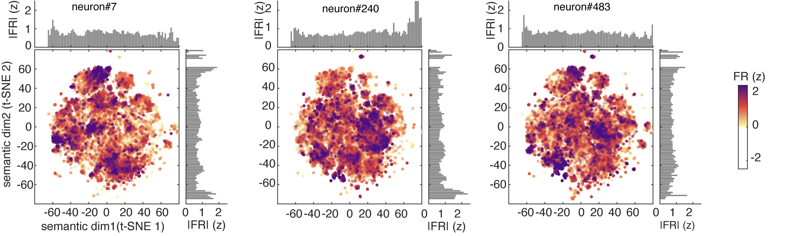

When we hear speech, neurons in our brains represent the meanings of the words. But there is no one-to-one relationship between neurons and words. Instead, each word is associated with a distinct *pattern* of neural activity, and the particular pattern depends on the context. In this study, we set out to determine the principles that shape those patterns. We found that each neuron responds to multiple unrelated words, and that the set of words driving a neuron is more dispersed than chance would predict. These results indicate that hippocampal neurons obey the principle of **polysemanticity**, and they support the idea that the brain uses **superposition** to represent more concepts than it has coding dimensions.

## The recording setup

We studied neurons from the brains of fifteen human participants with depth electrodes implanted in the hippocampus for the detection of seizure onset zones in intractable epilepsy. While the electrodes were in place, participants listened to six podcasts from *The Moth Radio Hour* — about forty-seven minutes of continuous storytelling, totalling more than seven thousand words.

Here is an example episode of the kind of story participants heard:

<iframe width="560" height="315" src="https://www.youtube.com/embed/9sGmJMgGDU8" title="The Moth Radio Hour" frameborder="0" allow="accelerometer; autoplay; clipboard-write; encrypted-media; gyroscope; picture-in-picture; web-share" allowfullscreen></iframe>

Across the fifteen patients we recorded just under five hundred neurons in total, sampled broadly within the hippocampus.

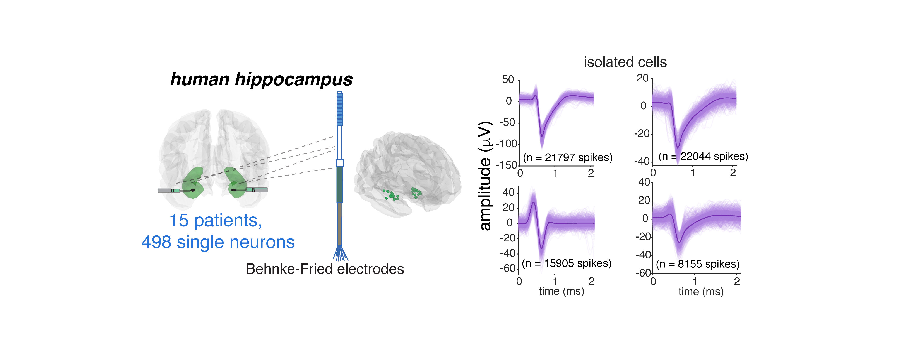

The neurons were well-isolated single units.

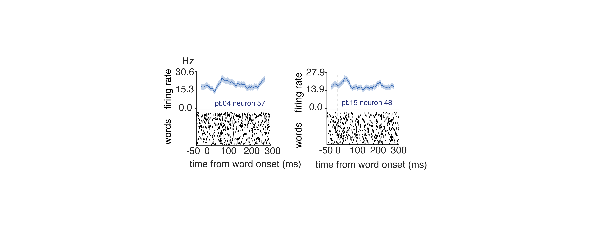

## Hippocampal neurons encode meaning

Before asking *how* neurons encode word meaning, we had to convince ourselves that they do at all. The evidence in humans has been thin.

We used a now-standard approach^[An *encoding model* learns a mapping from a feature space — here, semantic features extracted from a large language model — to neural firing rates, and is scored on held-out data.] to predict each neuron's firing from semantic features extracted from a language model. The features came from GPT-2, a transformer trained to predict the next word in a sequence; we used the activations from a deep layer that captures abstract meaning rather than surface form. Because we were interested in word concepts, we restricted the analysis to nouns.

The model worked. Across the recorded population, we could read out which word a participant had just heard from the pattern of hippocampal activity — many words were reconstructed perfectly, and nearly all the rest were close.

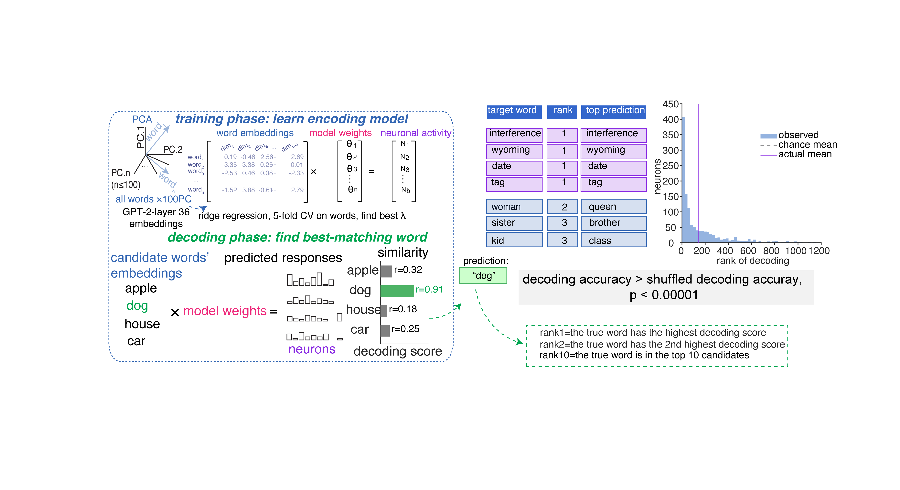

More than that, the *relationships* between words were preserved. Two words that are close in the language model's semantic space — say, *ocean* and *river* — were also close in the activity space of the hippocampal population.^[This kind of comparison is called *representational similarity analysis*: instead of asking whether two systems represent the same things, we ask whether they represent the *relationships between* things in the same way.] And crucially, the agreement between neural and semantic geometry kept improving as we added more neurons to the analysis.

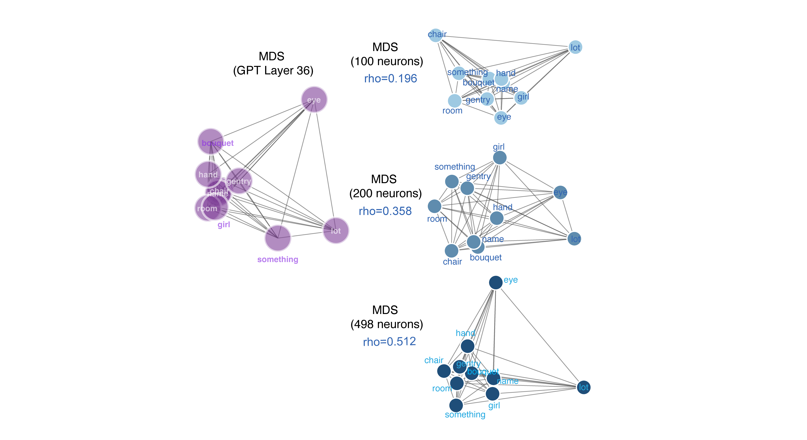

That scaling behaviour is itself diagnostic. If meaning were carried by a small number of dedicated "concept cells" — one neuron firing for *Jennifer Aniston*, another for *the Eiffel Tower* — then adding neurons that are silent for most words should contribute almost nothing, and the curve should saturate early. Instead, it climbs. Each additional neuron adds a little more information, which is what you'd expect if individual neurons carry *partial, overlapping* information about many words. To make sure this was really diagnostic, we ran the same analysis on simulated populations of classical concept cells: those simulated populations failed to recover the geometry at any population size we tested.

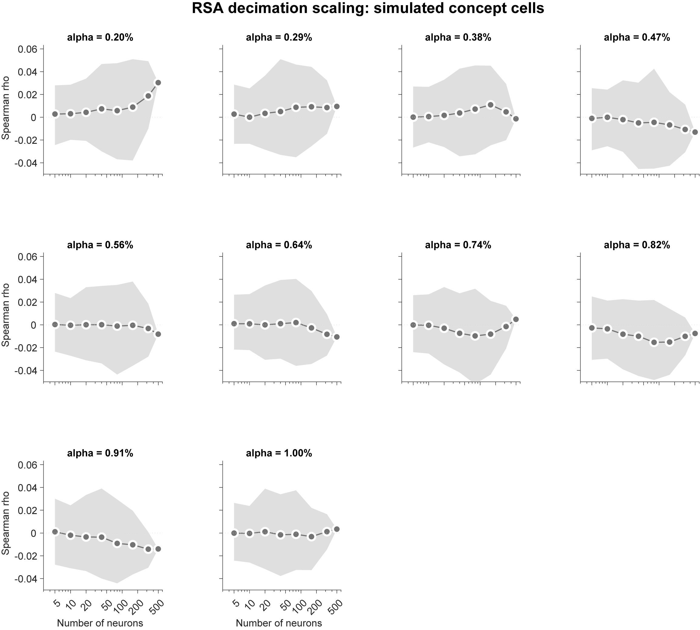

## Neurons with similar tuning don't form clean categories

A classical concept cell that prefers, say, *Christmas* should fire to words that are semantically adjacent — *reindeer*, *snow*, *candy canes*, even abstract relatives like *family* and *generosity*. Polysemanticity predicts the opposite: a neuron's preferred words should *not* cluster into a tight semantic neighbourhood, and may in fact be more scattered than chance.

To test this, we asked whether functional groupings inside the population — sets of neurons with similar tuning — line up with the natural categories of language. We extracted these groupings directly from the data,^[We used non-negative matrix factorisation, a decomposition technique that finds additive components in a similarity matrix. Each component picks out a coherent pattern of co-tuning across the population.] and then asked, for each one, whether the words it preferred came from the same neighbourhood of semantic space or from many different neighbourhoods.

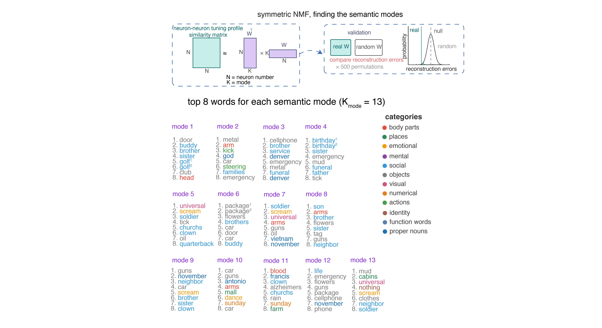

Almost none of the modules mapped onto a single semantic category. Most spanned several at once — one module recruited words that, in everyday language, would belong to entirely separate worlds. And many of the modules were *more* dispersed than chance: their top words were drawn from more distant regions of semantic space than you'd get by random sampling. This pattern held inside individual patients, not just at the group level.

## The code is dense, not sparse

If hippocampus uses concept cells, most neurons should sit silent for most words and respond to a small handful. We checked this from several angles, and they all told the same story.

We measured how selectively each word activates the population — whether a given word lights up just a few neurons or many of them. We measured how selectively each neuron responds across the vocabulary — whether a given neuron fires for a small handful of words or distributes its activity broadly. We measured the entropy of each neuron's firing across words, which captures how concentrated or uniform that distribution is. By every measure, hippocampal neurons looked considerably *denser* than simulated concept cells: each word recruited many neurons, and each neuron contributed a little to many words.

A dense code raises an immediate worry: maybe the broad tuning is just noise. A neuron that fires unreliably will *look* like it responds to many words without actually distinguishing among them. We checked this too, by asking how much information each neuron's firing rate actually carries about word identity. Real neurons carried substantially more information per word than the simulated concept cells did. The broad tuning is functionally meaningful — it supports fine-grained discrimination among words rather than averaging them all together.

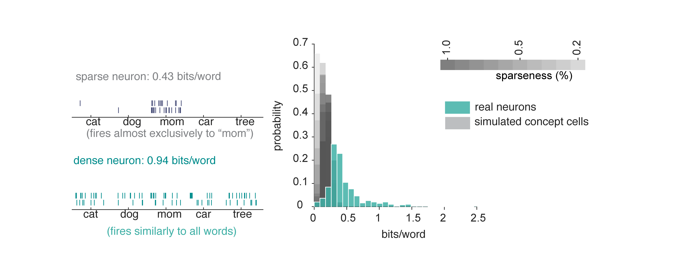

## Hippocampal neurons are polysemantic

One way to *see* a neuron's tuning is to look at its predicted response to a large vocabulary. We used a standard fifty-thousand-noun corpus and plotted three example neurons' responses on a 2D map of semantic space. The patterns are not what you'd get from a concept cell. Each neuron responds across a wide range of words, with several local clusters of particularly strong activation — what we call **modes**. A neuron has not one favourite, but many.

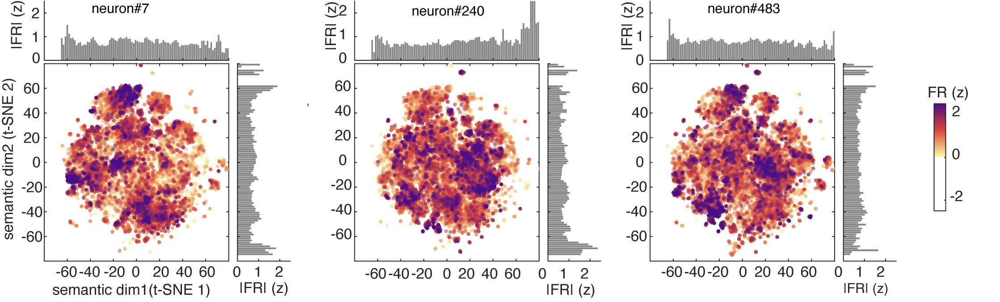

For comparison, simulated concept cells produce exactly the narrow single peaks you would expect — one tight cluster around the preferred concept, silence elsewhere.

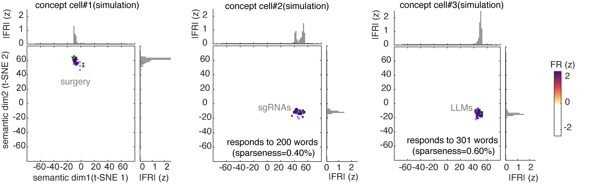

We then asked how those modes are arranged in semantic space. If neurons were sampling meaning at random, the modes should sit in a disordered cloud. Instead we found something more structured. The modes were spaced **regularly** — the gaps between them were unusually uniform. They were arranged **isotropically** — pointing in all directions away from the centre, rather than concentrating along a few preferred axes. And they were close to **equidistant** from their neighbours. What they were *not* was hexagonal — they showed none of the periodic, six-fold symmetry that defines grid cells in flat 2D environments.

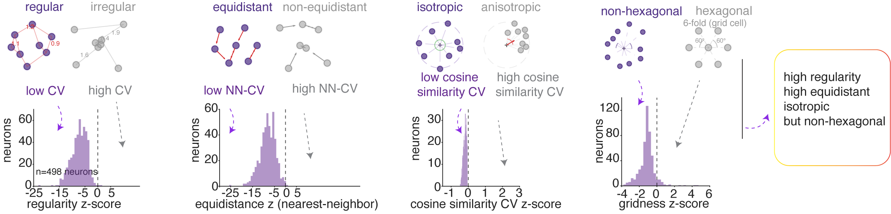

In other words, hippocampal neurons tile semantic space the way grid cells tile *complex, three-dimensional* spaces — uniformly and densely, but without the clean hexagons that emerge only in two flat dimensions. This kind of fragmented-but-regular geometry has been described in bats flying through 3D volumes and in animals navigating topologically complex environments. We see the same signature here, but for the space of meanings.

## A neuron's preferred words are scattered, not clustered

The geometric finding has a direct prediction at the level of single neurons: a neuron's top-firing words should not cluster around a single theme. They should be *overdispersed* — spread across semantic space more widely than a random sample of words. We tested this directly. For each neuron we took its highest-firing words and measured how spread out they were in the language model's embedding space, comparing against random word sets of the same size. Across the population, a substantial fraction of neurons had preferred-word sets that were significantly more dispersed than chance, and this held no matter how many top words we looked at.

## Context reshapes single-neuron tuning while preserving population geometry

A polysemantic code carries a useful side-effect. If a single neuron participates in many meanings, then different contexts can call up different meanings without rewiring anything — the network simply weights the same neurons differently when the story changes. We asked whether hippocampal neurons actually do this.

For each neuron, we measured how much its tuning to words shifted across different stories. The answer was: a lot. The same neuron's response to a given word looked noticeably different from one Moth story to the next, and this shift was visible in every single patient. It wasn't drift — neurons recorded close together in time looked just as different as neurons recorded far apart.

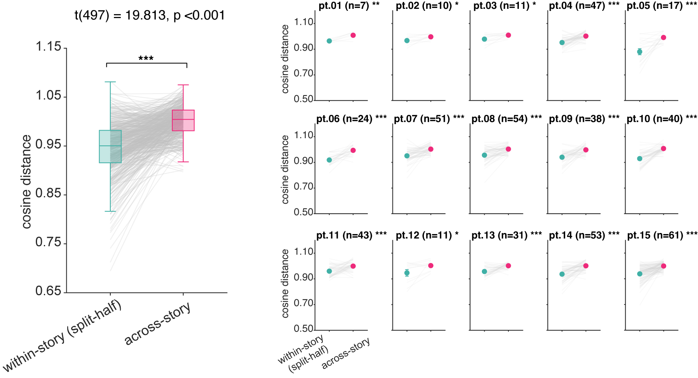

But here's the surprise. While individual neurons changed their tuning from story to story, the **population's geometry did not**. Pairs of words that were close together in one story remained close together in another. The map stayed the same; the readers shifted around on it. A polysemantic code makes this possible: the population can preserve relational structure while individual neurons reshuffle their roles.

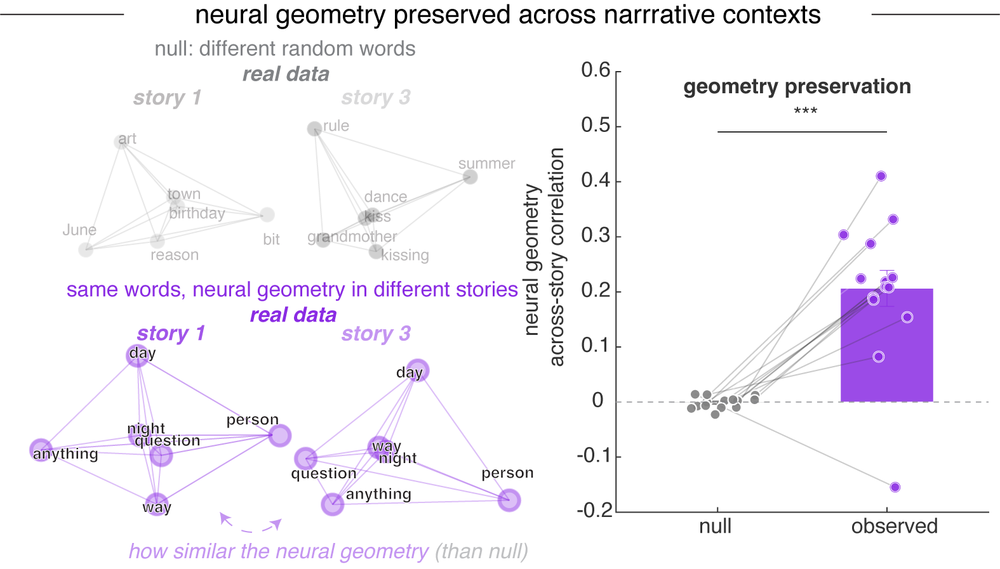

## Context changes how neurons read meaning in a non-linear mixed selectivity way

A neuron's response to a word doesn't happen in a vacuum. The same word — *bank*, *fly*, *cell* — can mean different things depending on what came before it. We asked whether hippocampal neurons are sensitive to that.

We compared three ways a neuron might use context to shape its firing. The first ignored context entirely and predicted activity from word identity alone. The second added context as a separate ingredient — the surrounding words could push firing up or down, but they couldn't change *what the neuron cared about*. The third allowed context and word to interact, so that the surrounding words could actually reshape how the neuron responded to meaning.

The third model won, across nearly every context window we tested. Adding context as a side ingredient helped, but letting context *bend* the neuron's tuning helped more. About a quarter of all the neurons we recorded only showed up as meaningful in this third model — they looked silent under simpler analyses, but came alive once we accounted for the interaction. And the effect cut across categories: many of the neurons that seemed to be encoding pure word identity, or pure context, turned out to be doing something more interesting.

What this means is that local context doesn't just nudge a neuron's firing rate up or down. It changes the question the neuron is asking. The same neuron reads meaning differently depending on what was just said — a hallmark of *non-linear mixed selectivity*, where single units combine multiple variables in ways that no linear sum could reproduce.

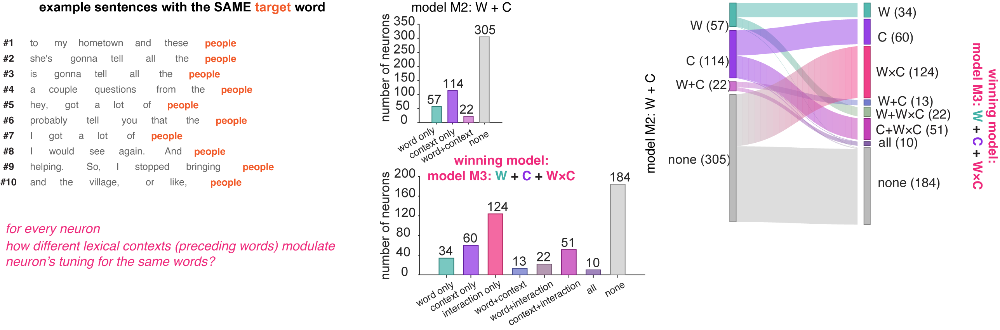

## Polysemantic codes enable pattern separation

The hippocampus is famous for **pattern separation** — taking two inputs that look similar and pushing them apart in neural space, so that they don't interfere with each other in memory. We asked whether the polysemantic code we'd been describing supports this.

The test: when the same word appears in different contexts within our podcasts, does the neural population represent it differently? And does the *amount* of difference scale with how different the contexts are? The answer to both was yes. Identical words in distinct contexts evoked distinct population responses, and the further apart the contexts were, the further apart the responses were. The system maps contextual differences onto representational differences in a graded way — exactly what pattern separation requires.

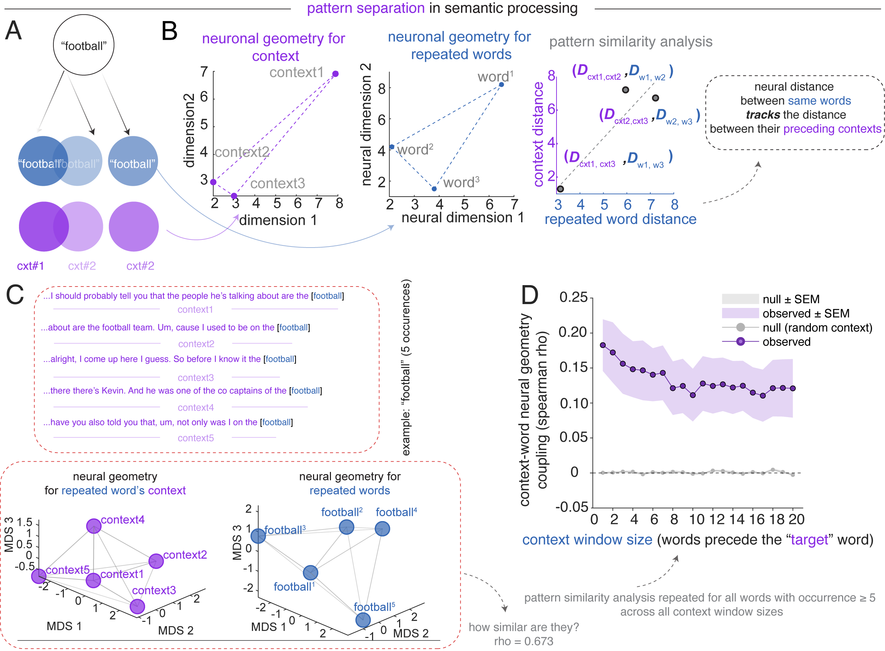

## Polysemantic codes enable pattern completion

The hippocampus is equally famous for the opposite trick — **pattern completion**, where a partial or noisy input retrieves a complete representation. Concept cells are excellent at this for individual concepts: one cue, one identity. But they aren't built for *relational* completion, where the system must infer not just an item but where that item sits in a richer structure of meaning.

A polysemantic code, by contrast, naturally supports this. If a neuron participates in many concepts, the broader population can settle onto the right semantic neighbourhood as contextual cues accumulate, even for words it has never been explicitly trained on.

We tested this directly. Across the embedding space, we asked whether the hippocampal population could classify words along a semantic dimension *after being trained on a different set of words for the same dimension*. The classifier never saw the test words during training; if it succeeded, the population's geometry must encode the dimension in an abstract, generalisable way. It did succeed, on most semantic dimensions we tried. The geometry generalises.

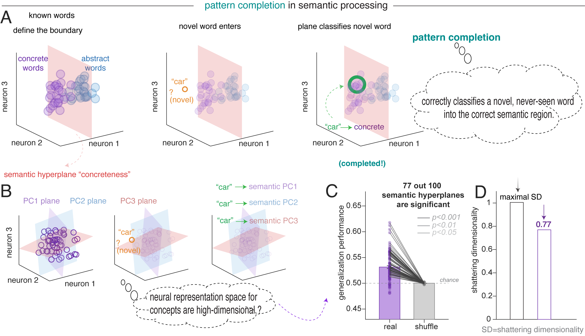

## What this means

Pulling everything together: the human hippocampus represents word meaning the way modern neural networks do — by packing many concepts into overlapping patterns of activity across a population, rather than by assigning each concept to its own dedicated detector. Individual neurons participate in many meanings; individual meanings recruit many neurons. The geometry of population activity tracks the geometry of language itself. Context bends single-neuron tuning while leaving population structure intact. The same code that lets the hippocampus separate similar inputs also lets it complete partial ones.

This isn't a refutation of concept cells. Classical concept-cell experiments use isolated, deliberately presented stimuli, which favour a one-concept-per-cell regime. Naturalistic speech, with thousands of fast-flowing concepts shaped by context, favours polysemanticity. Both regimes likely coexist, depending on what the input demands.

What strikes us most is the parallel with the hippocampus's older trick. In navigating large physical spaces, place cells develop multiple unrelated firing fields and grid cells tile the world with repeating, multi-peaked maps; in topologically complex three-dimensional spaces, even grid cells become fragmented and polysemantic. Here we see the same architecture again — for the space of meanings. The hippocampus seems to have one general-purpose strategy for representing high-dimensional spaces, whether the space is physical, semantic, or something else entirely.

## Read the paper

The full preprint is available on bioRxiv: [Polysemanticity in Human Hippocampal Neurons](https://www.biorxiv.org/content/10.64898/2026.05.02.722435v1).

## Acknowledgements {.appendix}

We thank the patients who participated in this study, and the clinical teams at Baylor College of Medicine who made these recordings possible.