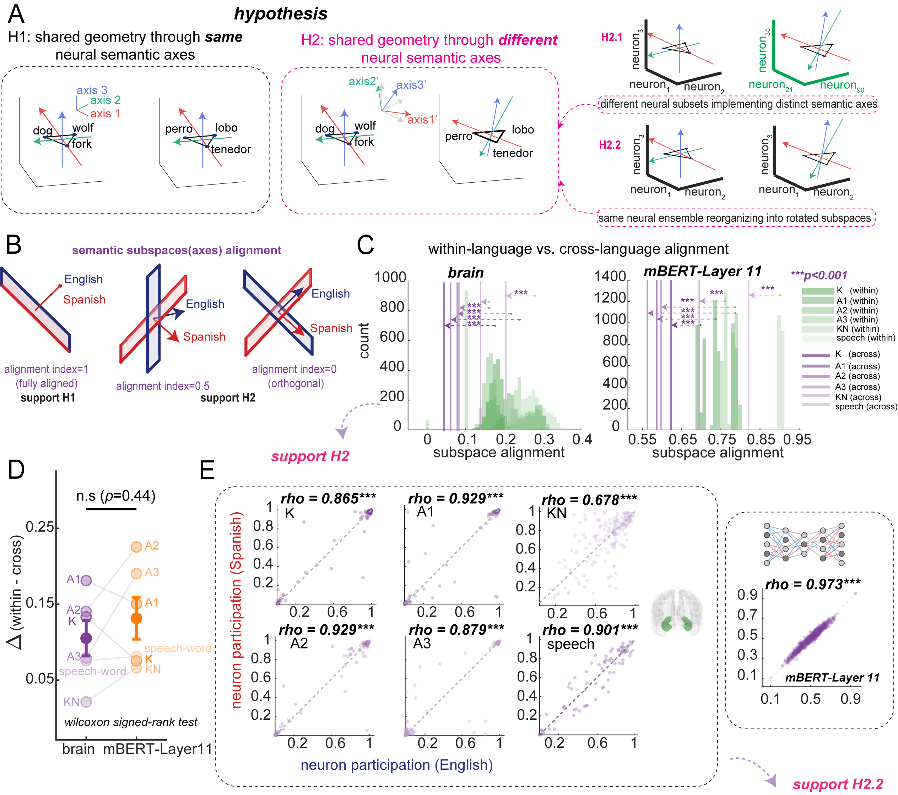

::: {.author-list}
Xinyuan Yan^1†^, Ana G. Chavez^1^, Melissa Franch^1^, Kalman A. Katlowitz^1^, Ivy Gautam^1^, Brian Kim^1^, Aaditya Krishna^1^, Aadit Shrivastava^1^, Katie Van Arsdel^1^, James Belanger^1^, Assia Chericoni^1^, Taha Ismail^1^, Elizabeth A. Mickiewicz^1^, Danika Paulo^1^, Hanlin Zhu^1^, Alica M. Goldman^2^, Vaishnav Krishnan^2,3^, Atul Maheshwari^2^, Eleonora Bartoli^1,3^, Nicole R. Provenza^1,3,4^, Seng Bum Michael Yoo^5,6,7^, Benjamin Y. Hayden^\*†1,3,8^, and Sameer A. Sheth^\*†1,3^
:::

::: {.affiliations}
1. Department of Neurosurgery, Baylor College of Medicine
2. Department of Neurology, Baylor College of Medicine
3. Neuroengineering Initiative, Rice University
4. Department of Bioengineering, Rice University
5. Department of Biomedical Engineering, Sungkyunkwan University
6. Department of Intelligent Precision Health Convergence, Sungkyunkwan University
7. Center for Neuroscience Imaging Research, Sungkyunkwan University

::: {.footnote-symbols}
\* These authors contributed equally. † Correspondence: [Benjamin.Hayden@bcm.edu](mailto:Benjamin.Hayden@bcm.edu)
:::
:::

::: {.blog-authors}
**Blog post written by:** [Xinyuan Yan](https://scholar.google.com/citations?user=rdGDTMsAAAAJ)
:::

*For more details, see the paper ([Cell](#)).*

There is an old story about why the world has so many languages.

In the book of Genesis, chapter 11, everyone on Earth speaks the same tongue. United by it, they begin to build a city with a tower tall enough to reach the heavens. The project alarms the divine, and the response is not to topple the tower but to do something subtler: confuse their speech, so that no one can understand their neighbor. Unable to coordinate, the builders scatter across the Earth. The place is named **Babel**, from a word for *confusion*.

For thousands of years, that story has been our metaphor for what languages do to us. They divide. A wall of unfamiliar sounds drops between you and another person, and meaning gets lost on the way across.

But here is a fact the story does not account for. Right now, more than half the people on the planet speak two or more languages, and they move between them without confusion at all. A bilingual friend can hear a sentence in Spanish and answer in English without missing a beat. Somewhere inside one human head, *both* sides of Babel coexist peacefully.

How? When you learn that a *dog* is also a *perro*, and "狗", where does that connection live? Does your brain keep two separate dictionaries and look words up one at a time? Or is there something underneath the words — a single, shared idea of "dog-ness" that both languages simply point to?

We went looking for the answer in the most direct way anyone has tried: by listening to individual brain cells, one at a time, in people who are fluent in two languages.

## Listening to single neurons

Most brain studies use scanners that watch blood flow across whole regions, like watching a stadium from a blimp — you can see which sections of the crowd are excited, but not what any single person is doing. We wanted to watch the individual people. That means recording from single **neurons**, the brain's basic signaling cells, which "speak" by firing tiny electrical pulses.

You cannot ethically open a healthy person's skull just to satisfy scientific curiosity. But occasionally, patients with severe epilepsy have thin electrodes placed in their brains as part of their medical care, to find where their seizures begin. With their consent, while those electrodes are already in place, we can listen in.

We worked with four people who were *balanced bilinguals* — they learned both English and Spanish as young children, around ages four to five, and use both every day with equal ease. Such patients are extraordinarily rare, which is part of why this study had not been done before. We focused on the **hippocampus**, a seahorse-shaped structure deep in the brain that is famous for memory but, as our lab has shown, also tracks the *meanings* of words as you hear and speak them.

We recorded while our participants did three different things, in both languages:

- **Listened** to matched stories and podcasts in English and Spanish (about two hours each).
- **Read aloud** short matched phrases, switching between the two languages.
- **Held real conversations**, unscripted, with native English and Spanish speakers.

Altogether we captured the activity of hundreds of individual neurons. Then we asked a simple-sounding question: when a word and its translation mean the same thing, do the same brain cells respond the same way?

## The hunt for "translation cells"

The most intuitive guess is that the brain has special **translation neurons**: cells that don't care which language you use, and fire the same way for *earth* and *tierra*, *friends* and *amigos*.

We found a few. A small number of neurons really did respond similarly to a word and its translation — fire a lot for *friends*, and also fire a lot for *amigos*; stay quiet for *and*, and also for *y*. We called these **cross-language neurons**.

But there was a catch. They were *rare* — usually only a handful out of every hundred neurons. Far too few to do all the heavy lifting of translation on their own. And when we looked more carefully at the rest of the cells, the intuitive picture fell apart completely.

For almost every neuron, we measured its **tuning**, that is, the full profile of which kinds of features of words make it fire and which leave it cold, like mapping a person's exact taste in music. Then we compared each neuron's English taste to its Spanish taste.

They mostly did not match. A given neuron might be picky about one set of meanings in English and an almost unrelated set in Spanish. At the level of single cells, English-brain and Spanish-brain looked like different machines.

So how does a bilingual person ever feel that *dog* and *perro* are the same thought?

## The shape of meaning

The answer turned out to live not in any single neuron, but in the *pattern across all of them at once*.

Here is the key idea, and it is worth slowing down for, because it is the heart of the paper.

Imagine you don't track what each neuron does individually. Instead, for every word, you write down the activity of the *whole population* of neurons as a single point in space. Words that produce similar brain activity land close together; words that produce different activity land far apart. Do this for thousands of words and you get a kind of **map of meaning** — a landscape where *cat* and *dog* are neighbors, *door* sits off in another district, and *galaxy* is across town.

We call the layout of that map its **semantic geometry**: not which neuron means what, but how all the meanings are arranged *relative to each other*.

Now the crucial test. We built this map twice — once from the English words, once from the Spanish words — and laid them side by side.

They had the same shape.

If *cat* and *dog* were close in the English map, then *gato* and *perro* were close in the Spanish map. If *human* and *galaxy* were far apart in one, they were far apart in the other. The distances between meanings were preserved across the two languages, even though, as we just saw, the individual neurons building those distances behaved completely differently.

So translation does not happen word by word, neuron by neuron. It happens because both languages are drawn on the *same underlying map*. The tower of meaning never actually fell. Babel only scattered the labels.

## One map, read with two different compasses

This raises a beautiful puzzle. If the same population of neurons holds one shared map, and English and Spanish both use it, why don't the two languages constantly bleed into each other? Why doesn't hearing *gato* make you blurt out *cat*?

Our data point to an elegant trick. The two languages use the **same neurons** and the **same map**, but they read it along **different directions** — as if holding the identical map but orienting it with a rotated compass.

In geometry, you can rotate a whole shape and every distance inside it stays exactly the same; a triangle is the same triangle whether it sits upright or tilted. The brain seems to exploit this. English reads the shared meaning-map along one set of directions (we call them **readout axes**); Spanish reads the very same map along directions that are rotated relative to English. Same landscape, different angle of approach.

That rotation is the quiet hero of the story. It lets the two languages share *everything that matters* — the structure of meaning — while keeping their *access routes* separate enough that they don't collide. Shared meaning, separate readout. It is exactly the scheme a system would need if it had to be deeply bilingual without ever getting confused.

We confirmed this directly. When we looked at *which* neurons participated in building each language's map, the answer was: nearly the same neurons, to nearly the same degree, in both languages. The cells are shared. Only the directions differ.

## A surprising echo in artificial intelligence

One more thread is worth pulling, because it connects brains to the AI systems now in everyone's pocket.

Modern multilingual language models — the machinery behind translation apps and chatbots — were not designed to copy the brain. Yet when we compared the brain's meaning-map to the internal map of a multilingual AI model (a system called mBERT), they lined up. Words arranged a certain way in the brain were arranged similarly inside the machine, in both English and Spanish.

The match is not perfect, and the differences are interesting in their own right: the AI leans more on the surface look of words (it notices that *universe* and *universo* share letters), while the brain seems to care more about pure meaning. But the broad agreement is striking. Two very different kinds of system — one made of cells, one of math — seem to have independently discovered that the smart way to be bilingual is to share a geometry of meaning and read it from different angles.

## Rebuilding Babel

The Babel story imagines language as a punishment: a wall thrown up between people, scattering them apart. What we found inside the bilingual brain is almost the opposite. Beneath the two languages lies a single, quiet map of meaning that both of them point to. The surface words are scattered — different sounds, different spellings, even different neurons firing — but the deep structure, the relationships among ideas, is held in common.

A bilingual person is not running two separate dictionaries. They are reading one shared world of meaning through two different windows. The hippocampus keeps a model of meaning that does not belong to any single language. Translation, in this view, is not the hard work of matching word to word. It is the natural consequence of two languages drawing on the same underlying geometry.

The builders at Babel were scattered because they lost their common speech. But the bilingual brain suggests their common *meaning* was never really lost. It was just waiting, underneath, for two languages to find their way back to the same map.

## What this might mean

A few implications stand out to us.

**Meaning may be more fundamental than language.** Our results suggest the brain stores concepts in a form that is not tied to any particular language, and lets each language reach that form along its own route. The thought comes first; the words are how you fetch it.

**Sharing and separating can happen at once.** The combination of a shared map with rotated readout directions is a general solution to a hard problem: how to keep two things deeply connected and cleanly distinct at the same time. The same principle may show up wherever the brain has to do both.

**Brains and AI may be converging on the same idea.** We don't want to overclaim — cells and code differ in important ways — but the fact that a brain and a language model land on similar geometries hints that this might be a good general strategy for representing meaning, not a quirk of biology.

And a caution: we studied only four people, and only two related languages. Future work with more participants, with unrelated languages, and with people *learning* a new language could reveal how this shared map is built in the first place — how, neuron by neuron, two scattered tongues come to share one world.

## Acknowledgements {.appendix}

Funding details and acknowledgements are listed in the published paper. We are grateful, above all, to the patients who made this work possible.

## Read the paper

#
